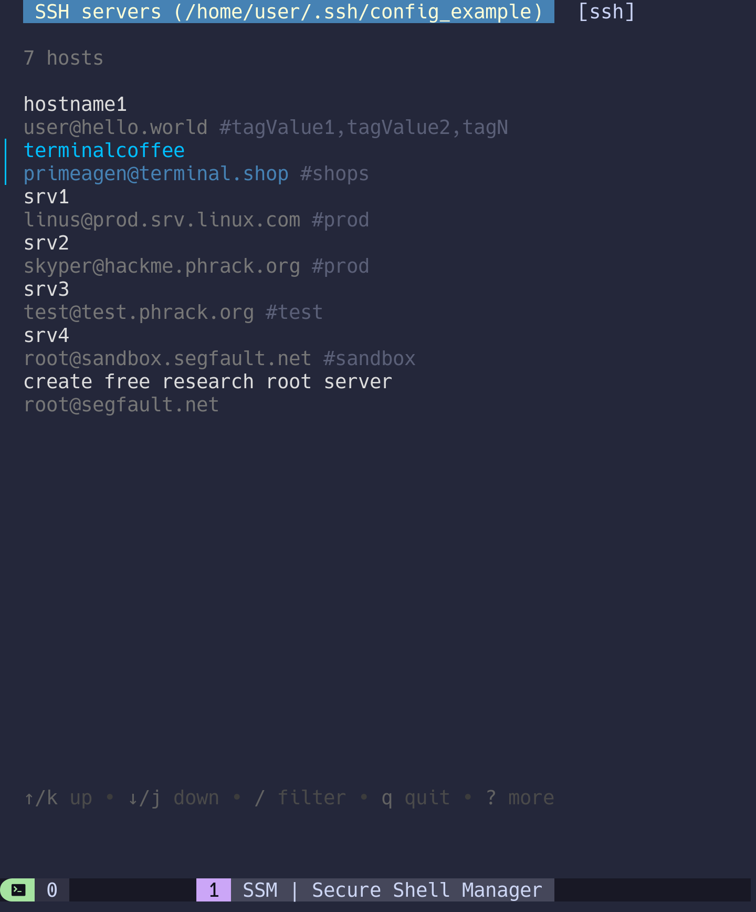

# Secure Shell Manager

> Streamline SSH with a simple Terminal UI

[![version][version-badge]](changelog.md)
[![license][license-badge]](license)
[](https://goreportcard.com/report/github.com/lfaoro/ssm)
[![follow on x][x-badge]](https://twitter.com/intent/follow?screen_name=leonardofaoro)

[version-badge]: https://img.shields.io/badge/version-0.3.2-blue.svg
[license-badge]: https://img.shields.io/badge/license-BSD3-blue
[x-badge]: https://img.shields.io/twitter/follow/leonardofaoro?label=follow&style=social

SSM is an SSH connection manager that helps engineers organize servers, connect, filter, tag, execute commands (soon), transfer files (soon), and much more from a simple terminal interface.

**tl;dr** - [try it now](#Quickstart)



## Features
- vim keys: jkhl, ctrl+d/u, g/G
- emacs keys: ctrl+p/n/b/f(up/down/left/right)
- filter through all your servers
- group servers using tags `#tag: admin`
- show only tagged servers `ssm admin`
- simple connect and return flow
- switch between SSH and MOSH with a tab
- quickly edit configs `<ctrl+e>`
- auto-reload SSH config on change
- `ctrl+v` shows all config params for selected host
- short-flags support e.g. `ssm -se` enables `--exit` and `--show`

See [CHANGELOG](changelog.md) for more info. \
See [HELP](data/help) for CLI flags.

## Keys
```
<enter↵>       connect to selected host
<ctrl+v>       show config for selected host
<ctrl+e>       edit ssh configs
<tab>          switch between SSH/MOSH
< / >          filter hosts
<q or esc>     quit

# under development (coming soon)
ctrl+r         run commands on the server without starting a pty 
ctrl+s         sftp upload/download files to/from server 
ctrl+g         port-forwarding UI 
space␣         select multiple hosts to interact with
```

## Quickstart
> If you're not accustomed to ssh config start here otherwise skip to [install](#install)
```bash
# backup any existing config
[ -f ~/.ssh/config ] && cp ~/.ssh/config ~/.ssh/config.bak
# create ssh config
cat <<EOF >>~/.ssh/config
Host hostname1
#tag: tagValue1,tagValue2,tagValueN
    User user
    HostName hello.world
    Port 2222
    IdentityFile ~/.ssh/id_rsa

Host terminalcoffee
#tag: shops
    User adam
    HostName terminal.shop

Host segfault.net
#tag: research
    User root
    HostName segfault.net
EOF
# file must have 600 perms for security
chmod 600 ~/.ssh/config
```

## Install
Download `ssm` binary from [releases](https://github.com/lfaoro/ssm/releases)
> available for [Linux, MacOS, FreeBSD, NetBSD, OpenBSD, Solaris] \
> on [x86_64, i386, arm64, arm] architectures,
_need more? just ask_

```bash
# bash one-liner
curl -sSL https://raw.githubusercontent.com/lfaoro/ssm/refs/heads/main/scripts/get.sh | bash
wget -qO- https://raw.githubusercontent.com/lfaoro/ssm/refs/heads/main/scripts/get.sh | bash
```

## Build
> requires [Go](https://go.dev/doc/install)

```bash
# bootstrap
go install github.com/lfaoro/ssm@latest

# build
git clone https://github.com/lfaoro/ssm.git \
  && cd ssm \
  && make build \
  && bin/ssm
```

## Help
- [SSH config manual](https://man.openbsd.org/ssh_config.5)
- [SSH config example](data/config_example)
- [create SSH config script](scripts/create_config.sh)
- [message me on X](https://x.com/leonardofaoro)
- [message me on Telegram](https://t.me/leonarth)

## Contributors
[See all](https://github.com/lfaoro/ssm/graphs/contributors)

Pull requests are very welcome and will be merged. \
Feature requests are also welcome, we're happy to implement your ideas.

### Support SSM

> If `ssm` is useful to you, kindly give us a star.

- **star the repo**
- **tell your friends**

- [GitHub sponsor](https://github.com/sponsors/lfaoro)
- [BTC sponsor](https://mempool.space/address/bc1qzaqeqwklaq86uz8h2lww87qwfpnyh9fveyh3hs)
- [XMR sponsor](https://xmrchain.net/search?value=9XCyahmZiQgcVwjrSZTcJepPqCxZgMqwbABvzPKVpzC7gi8URDme8H6UThpCqX69y5i1aA81AKq57Wynjovy7g4K9MeY5c)
- [FIAT sponsor](https://checkout.revolut.com/pay/1122870b-1836-42e7-942b-90a99ef5e457)
