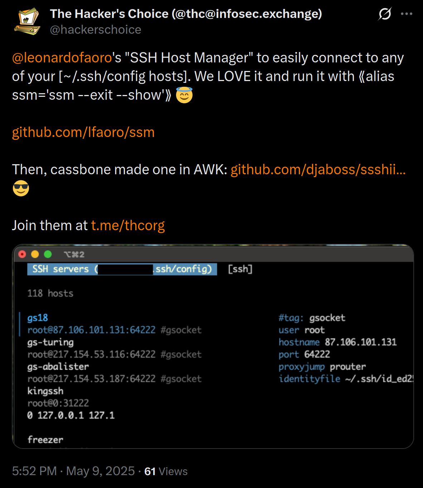

# Secure Shell Manager

> Streamline SSH connections with a simple Terminal UI

[![version][version-badge]](changelog.md)
[![license][license-badge]](license)
[](https://goreportcard.com/report/github.com/lfaoro/ssm)
[![follow on x][x-badge]](https://x.com/intent/follow?screen_name=leonardofaoro)

[version-badge]: https://img.shields.io/badge/version-0.3.5-blue.svg
[license-badge]: https://img.shields.io/badge/license-BSD3-blue
[x-badge]: https://img.shields.io/twitter/follow/leonardofaoro?label=follow&style=social

# Purpose
Scratching my own itch: `ssm` is an SSH connection manager designed to connect, filter, tag, and much more from a simple terminal interface. Works on top of installed command-line programs and does not require any setup on remote systems.

**tl;dr** - [try now](#Install)

See [HELP](data/help) for CLI flags. \
See [CHANGELOG](changelog.md) for dev info.



## Features
- vim keys: jkhl, ctrl+d/u, g/G
- emacs keys: ctrl+p/n/b/f
- filter through all your servers
- switch between SSH and MOSH with a tab
- `ctrl+e` edit the loaded config
- `ctrl+v` shows all config params
- config will automatically reload on change
- CLI short-flags support e.g. `ssm -seo` enables `--show`, `--exit`, and `--order`
- group servers using tags e.g. `#tag: admin`
- show only admin tagged servers `ssm admin`
- use `#tagorder` key to prioritize tagged hosts in list-view
- use `--theme` to change color scheme
- edit [themes.go](pkg/tui/themes.go) to add more

## Keys
```
<enter↵>       connect to selected host
<ctrl+e>       edit ssh config
<ctrl+v>       show all config params
<tab>          switch between SSH/MOSH
< / >          filter hosts
<q or esc>     quit

# under development (coming soon)
ctrl+r         run commands on the server without starting a pty 
ctrl+s         sftp upload/download files to/from server 
ctrl+g         port-forwarding UI 
space␣         select multiple hosts to interact with
```

## Quickstart
> If you're not accustomed to ssh config start here otherwise skip to [Install](#install)
- [SSH config manual](https://man.openbsd.org/ssh_config.5)
```bash
# backup any existing config
[ -f ~/.ssh/config ] && cp ~/.ssh/config ~/.ssh/config.bak
# create ssh config
cat <<EOF >>~/.ssh/config
# This is an example config for SSH

#tagorder is a key used to prioritize #tag: hosts in list-view

Host hostname1
#tag: tagValue1,tagValue2,tagValueN
    User user
    HostName hello.world
    Port 2222
    IdentityFile ~/.ssh/id_rsa

Host segfault.net
#tag: research
    User root
    HostName segfault.net

Host terminalcoffee
#tag: shops
    User adam
    HostName terminal.shop
EOF
# file must have 600 perms for security
chmod 600 ~/.ssh/config
```

## Install
Download `ssm` binary from [releases](https://github.com/lfaoro/ssm/releases)
> available for [Linux, MacOS, FreeBSD, NetBSD, OpenBSD, Solaris] \
> on [x86_64, i386, arm64, arm] architectures,
_need more? just ask_

```bash
# verify the binary is signed with my key
gpg --verify ssm_sig ssm
```

```bash
# bash script install for linux|macos|freebsd|netbsd|openbsd|solaris
curl -sSL https://github.com/lfaoro/ssm/raw/main/scripts/get.sh | bash
wget -qO- https://github.com/lfaoro/ssm/raw/main/scripts/get.sh | bash

# we don't pay Apple for a signing key, therefore you might need to run
xattr -d com.apple.quarantine ssm # on MacOS

# brew tap for macos/linux
brew install lfaoro/tap/ssm
```

<!-- See [install](install.md) for more... -->

## Build
> requires [Go](https://go.dev/doc/install)

```bash
# bootstrap
go install github.com/lfaoro/ssm@latest

# build
git clone https://github.com/lfaoro/ssm.git \
  && cd ssm \
  && make \
  && bin/ssm

# build from sr.ht mirror
git clone https://git.sr.ht/~faoro/ssm \
  && cd ssm \
  && make \
  && bin/ssm

make clean
# clean everything even caches
make distclean
```

## Help
- [SSH config example](data/config_example)
- [message me on Telegram](https://t.me/leonarth)
- [tag me on X](https://x.com/leonardofaoro)

## Contributors
[See all](https://github.com/lfaoro/ssm/graphs/contributors)

Pull requests are very welcome and will be merged. \
Report a bug or request a new feature, feel free to open a [new issue](https://github.com/lfaoro/ssm/issues).

## Show support

> If `ssm` is useful to you, please consider giving it a ⭐.

- **star the repo**
- **tell your friends**

- [GitHub sponsor](https://github.com/sponsors/lfaoro)
- [BTC sponsor](https://mempool.space/address/bc1qzaqeqwklaq86uz8h2lww87qwfpnyh9fveyh3hs)
- [XMR sponsor](https://xmrchain.net/search?value=89XCyahmZiQgcVwjrSZTcJepPqCxZgMqwbABvzPKVpzC7gi8URDme8H6UThpCqX69y5i1aA81AKq57Wynjovy7g4K9MeY5c)
- [FIAT sponsor](https://checkout.revolut.com/pay/1122870b-1836-42e7-942b-90a99ef5e457)
